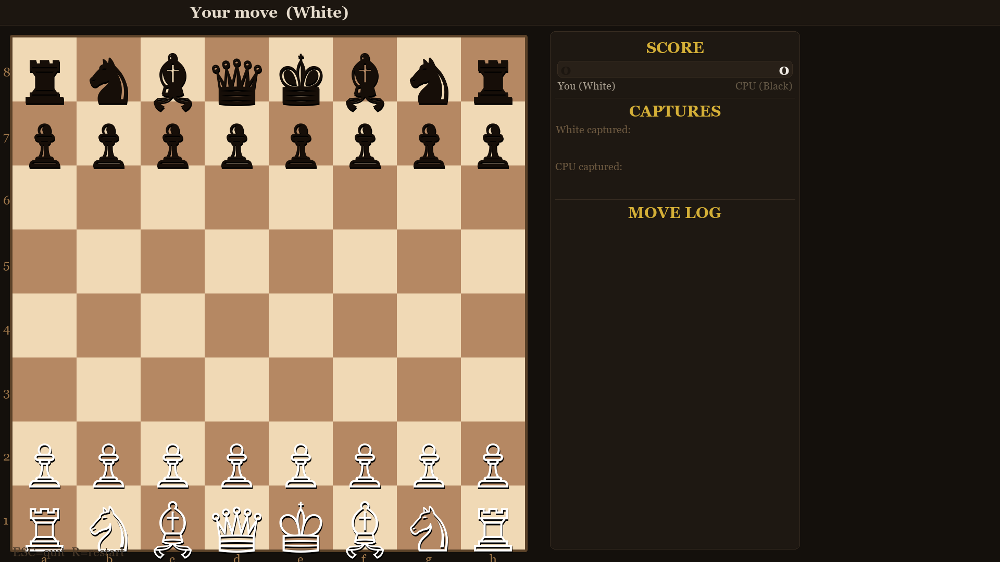
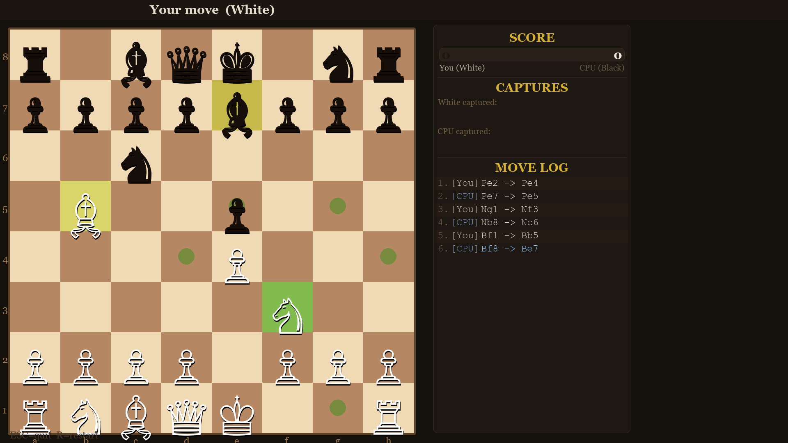
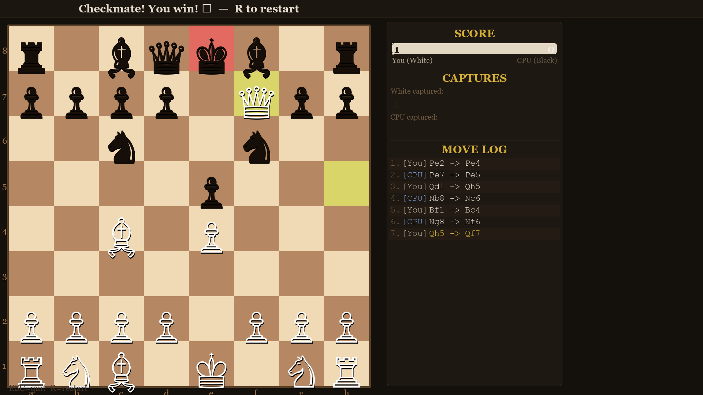

# Chess

A single-player chess game built with Python and Pygame. Play as White against a CPU opponent powered by a minimax AI with alpha-beta pruning.

## Screenshots

### Opening Position


### Mid-Game with Move Highlights


### Checkmate


## Features

- **Play vs CPU** -- Play as White against a Black CPU opponent with depth-3 minimax search
- **Drag & drop or click** -- Move pieces by clicking or dragging them
- **Move validation** -- Full chess rules including castling, en passant, and pawn promotion
- **Visual feedback** -- Highlighted legal moves, last move indicators, check warnings, and CPU move highlights
- **Sidebar panel** -- Live score bar, captured pieces display, and scrollable move log
- **Fullscreen** -- Responsive layout that adapts to your screen resolution
- **Unicode pieces** -- Clean rendering using Unicode chess symbols

## Controls

| Key | Action |
|-----|--------|
| Click / Drag | Select and move pieces |
| `R` | Restart game |
| `ESC` | Quit |
| Scroll / Arrow keys | Scroll move log |

## Requirements

- Python 3.x
- Pygame

## Running

```bash
pip install pygame
python Chess_oneplayer.py
```
