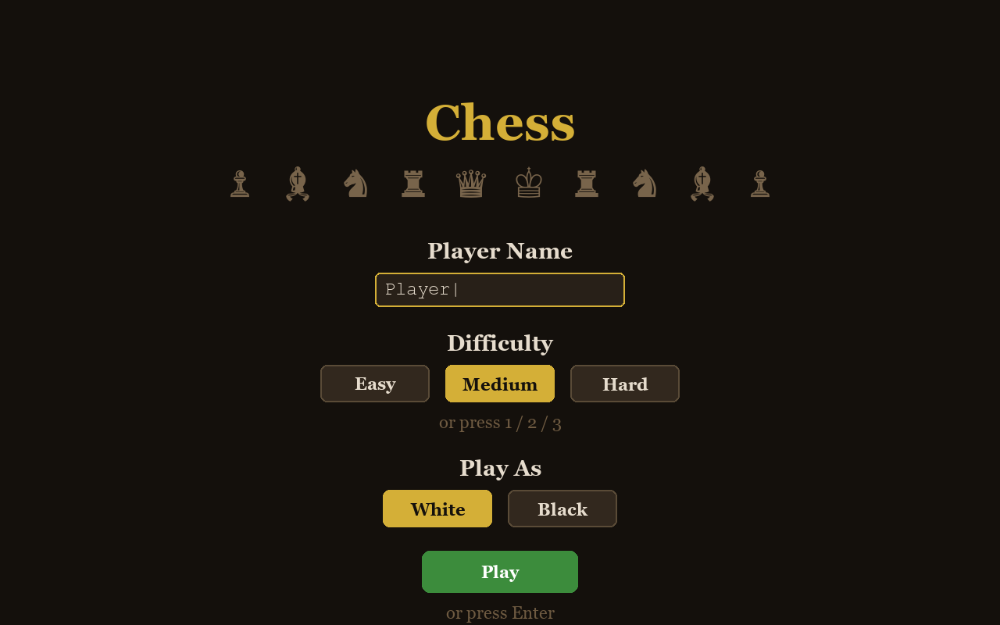
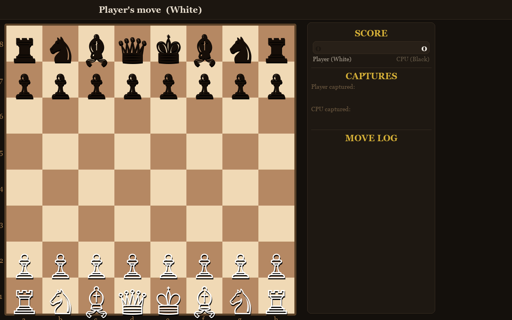
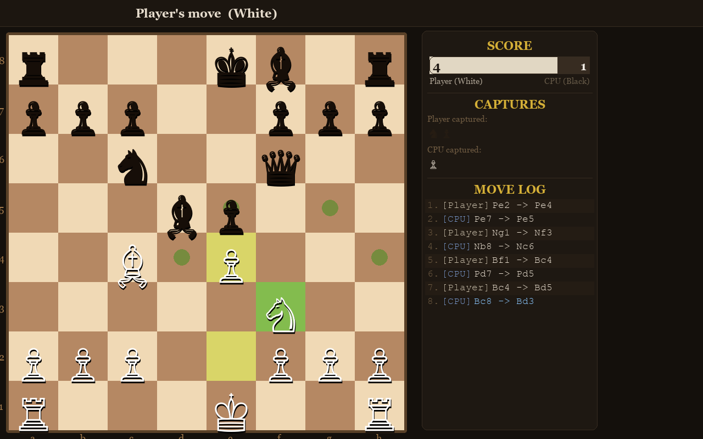
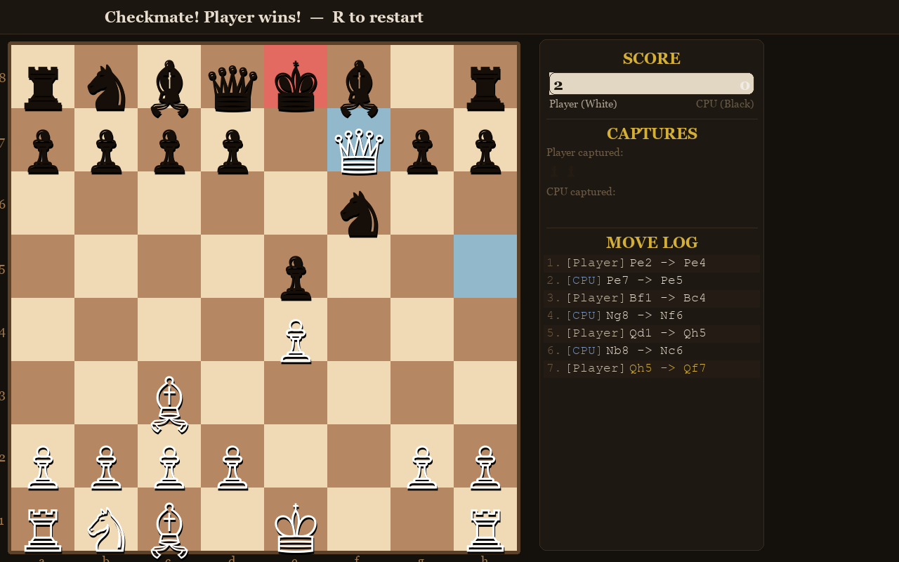
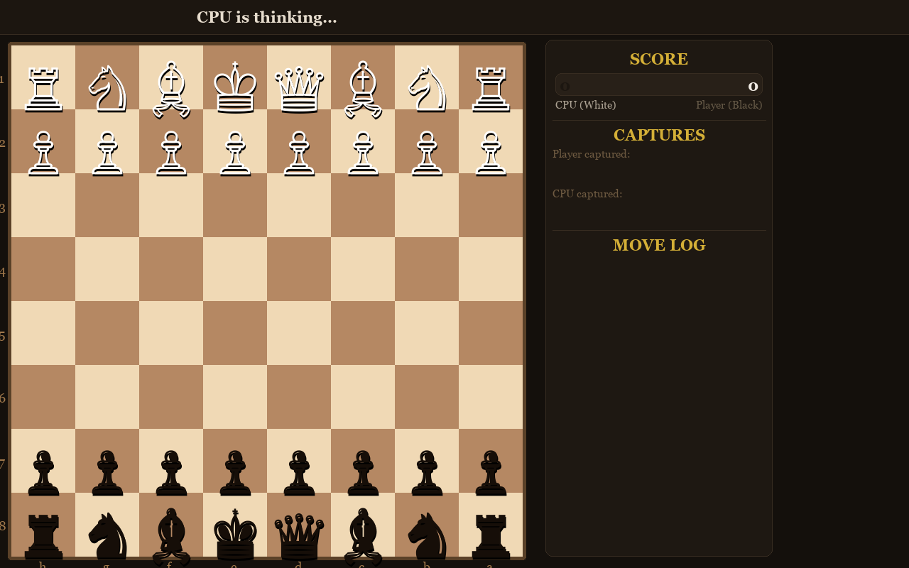
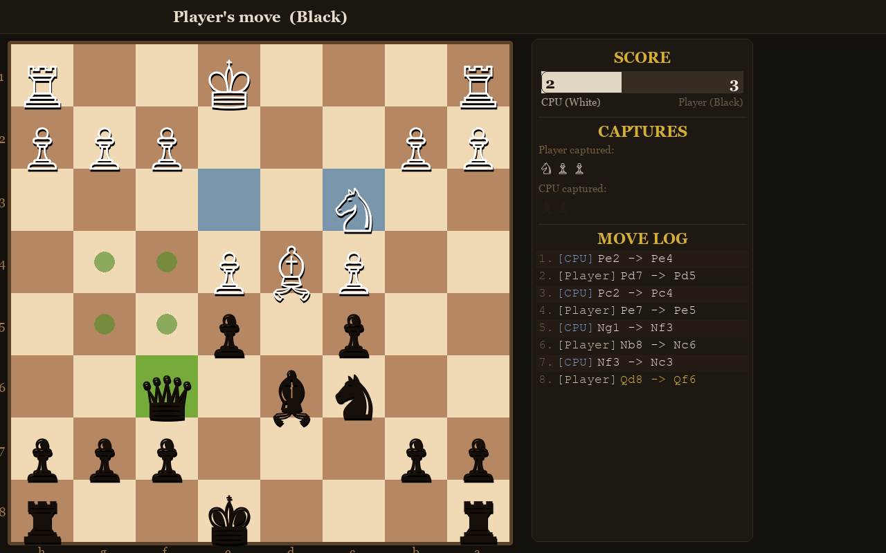
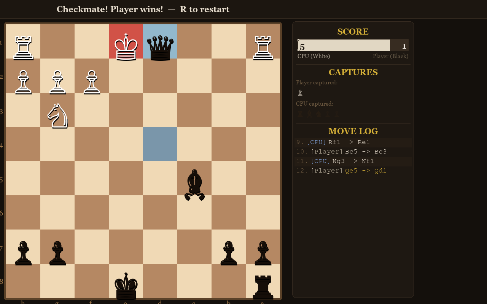
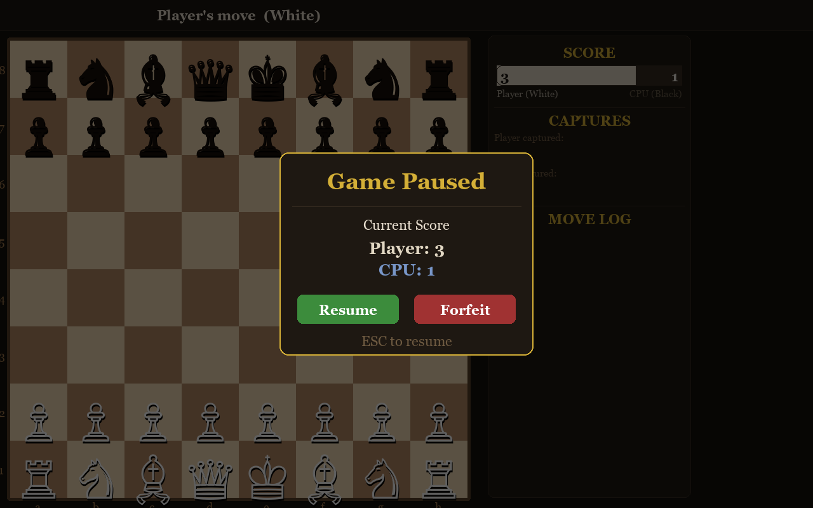

# Chess

A single-player chess game built with Python and Pygame. Play as White or Black against a CPU opponent powered by a minimax AI with alpha-beta pruning.

## Screenshots

### Start Menu


### Playing as White

| Opening | Mid-Game | Checkmate |
|---------|----------|-----------|
|  |  |  |

### Playing as Black

| Opening | Mid-Game | Checkmate |
|---------|----------|-----------|
|  |  |  |

### Pause Menu


## Features

- **Start menu** -- Enter your player name, choose your color, and select a difficulty before playing
- **Difficulty levels** -- Easy, Medium, and Hard (minimax search depth 1, 2, or 3)
- **Play as White or Black** -- Choose which side to play; the board flips accordingly
- **Drag & drop or click** -- Move pieces by clicking or dragging them
- **Move validation** -- Full chess rules including castling, en passant, and pawn promotion
- **Visual feedback** -- Highlighted legal moves, last move indicators, check warnings, and CPU move highlights
- **Sidebar panel** -- Live score bar, captured pieces display, and scrollable move log
- **Pause menu** -- Press ESC to pause, view the score, and choose to resume or forfeit
- **Resizable window** -- Minimize, maximize, or resize the window freely
- **Unicode pieces** -- Clean rendering using Unicode chess symbols

## Controls

| Key | Action |
|-----|--------|
| Click / Drag | Select and move pieces |
| `ESC` | Pause menu |
| `R` | Restart game |
| `1` / `2` / `3` | Select difficulty (start menu) |
| Scroll / Arrow keys | Scroll move log |

## File Structure

| File | Description |
|------|-------------|
| `chess_game.py` | Main game loop, rendering, and entry point |
| `chess_ai.py` | Board logic and minimax AI with alpha-beta pruning |
| `chess_menus.py` | Start menu and pause menu |

## Requirements

- Python 3.x
- Pygame

## Running

```bash
pip install pygame
python chess_game.py
```
