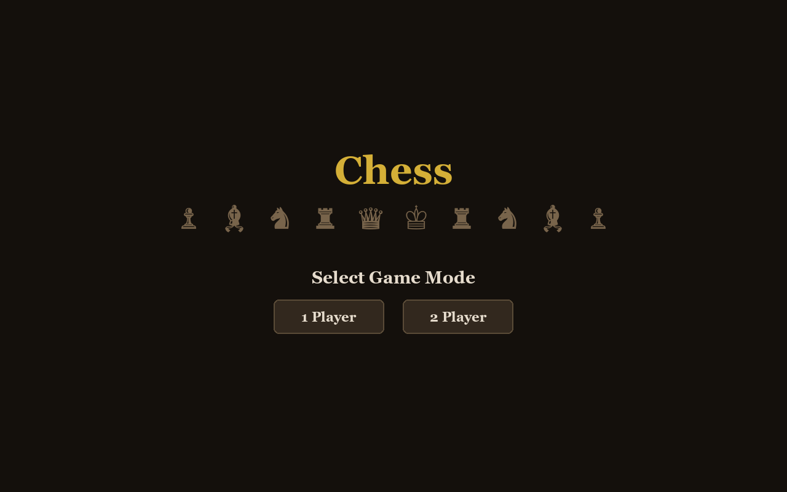
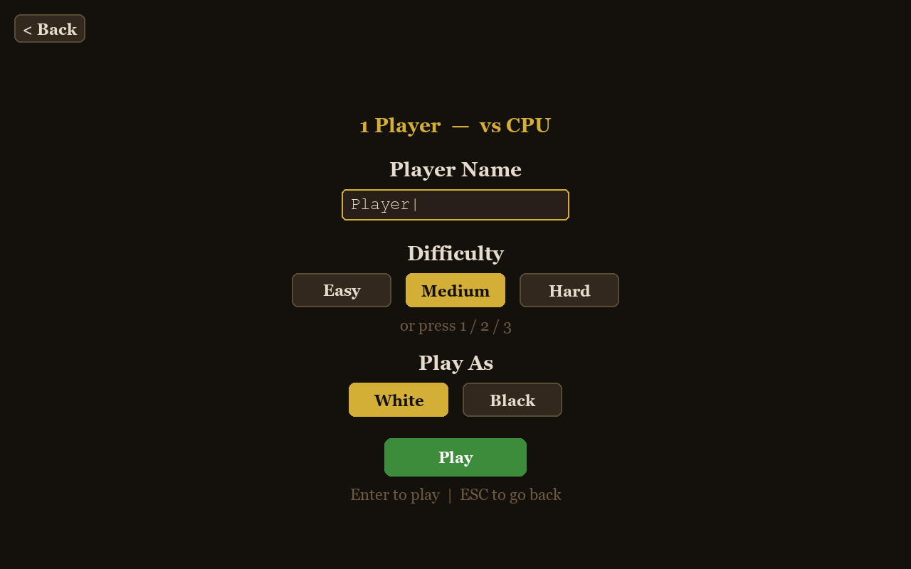
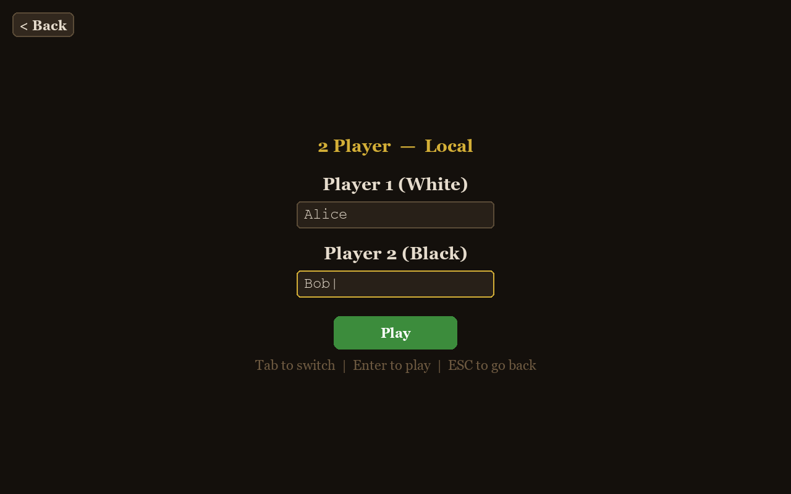
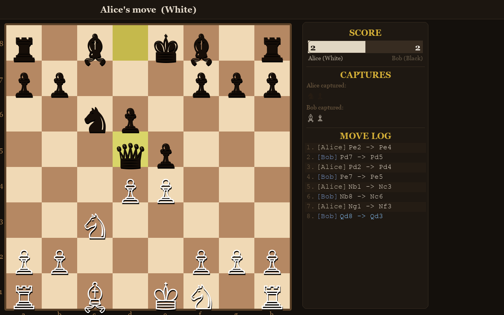
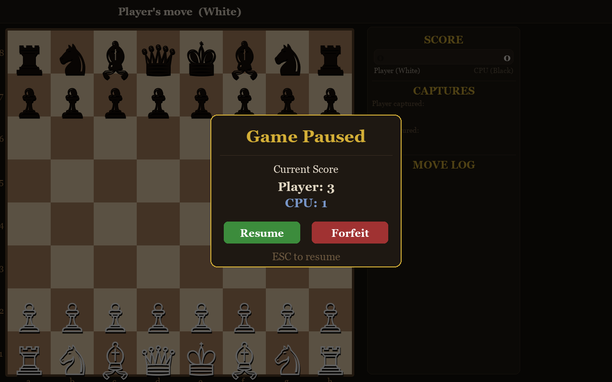
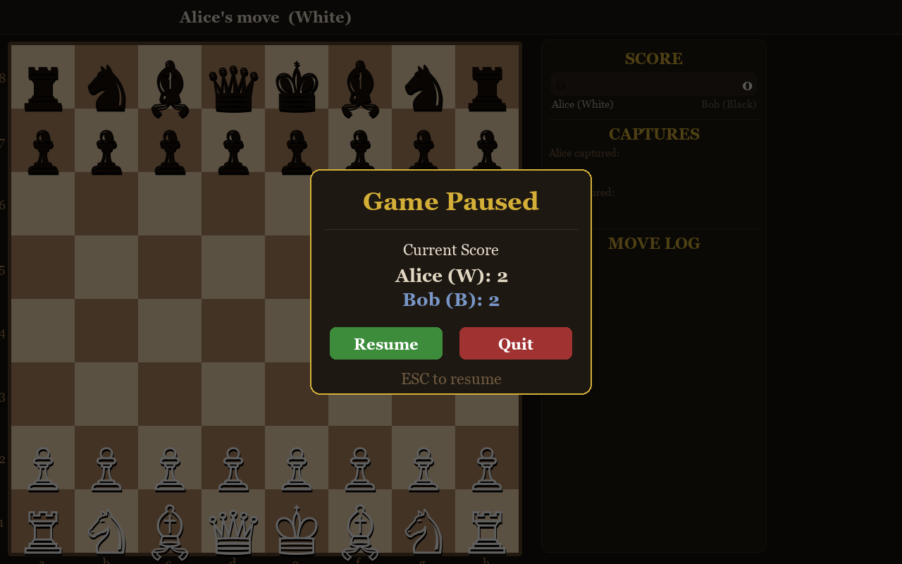

# Chess

A chess game built with Python and Pygame. Play against a CPU opponent powered by minimax AI with alpha-beta pruning, or play locally with a friend.

## Screenshots

### Menus

| Main Menu | 1 Player Settings | 2 Player Settings |
|----------------|-------------------|-------------------|
|  |  |  |

### 1 Player — Playing as White

| Opening | Mid-Game | Checkmate |
|---------|----------|-----------|
|  |  |  |

### 1 Player — Playing as Black

| Opening | Mid-Game | Checkmate |
|---------|----------|-----------|
|  |  |  |

### 2 Player — Local Game



### Pause Menus

| 1 Player (Forfeit) | 2 Player (Quit) |
|---------------------|-----------------|
|  |  |

## Features

- **1 Player or 2 Player** -- Play against the CPU or locally with a friend
- **Difficulty levels** -- Easy, Medium, and Hard (minimax search depth 1, 2, or 3)
- **Play as White or Black** -- Choose which side to play in 1 Player mode; the board flips accordingly
- **Drag & drop or click** -- Move pieces by clicking or dragging them
- **Move validation** -- Full chess rules including castling, en passant, and pawn promotion
- **Visual feedback** -- Highlighted legal moves, last move indicators, check warnings, and CPU move highlights
- **Sidebar panel** -- Live score bar, captured pieces display, and scrollable move log
- **Pause menu** -- Press ESC to pause, view the score, and choose to resume, forfeit (1P), or quit (2P)
- **Resizable window** -- Minimize, maximize, or resize the window freely
- **Unicode pieces** -- Clean rendering using Unicode chess symbols

## Controls

| Key | Action |
|-----|--------|
| Click / Drag | Select and move pieces |
| `ESC` | Pause menu / go back |
| `1` / `2` / `3` | Select difficulty (1 Player settings) |
| `Tab` | Switch name input (2 Player settings) |
| Scroll / Arrow keys | Scroll move log |

## File Structure

| File | Description |
|------|-------------|
| `chess_game.py` | Main game loop, rendering, and entry point |
| `chess_ai.py` | Board logic and minimax AI with alpha-beta pruning |
| `chess_menus.py` | Menus (mode selection, settings, pause) |

## Requirements

- Python 3.x
- Pygame

## Running

```bash
pip install pygame
python chess_game.py
```
